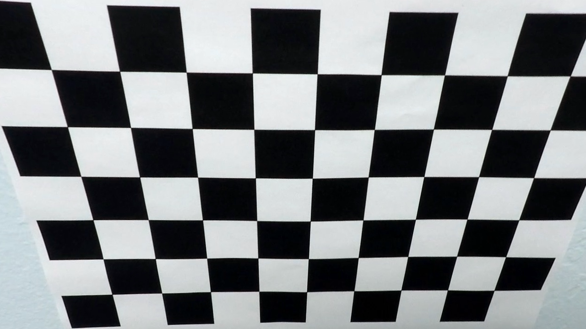

This report come as part of the Udacity Nanodegree on Self Driving Car Engineering.

### Introduction
  In this project, the objective is to use the OpenCV library to perform track line recognition. We will start by testing our algorithm on images and then directly on videos.

### Description
  In this project, the main part has already be seen during the course. The expectation here was to assemble the whole in an algorithm that will be able to process directly video input. In order to do so, we had to follow a certain number of steps which are the following:
  
* Compute the camera calibration matrix and distortion coefficients given a set of chessboard images.
* Apply a distortion correction to raw images.
* Use color transforms, gradients, etc., to create a thresholded binary image.
* Apply a perspective transform to rectify binary image ("birds-eye view").
* Detect lane pixels and fit to find the lane boundary.
* Determine the curvature of the lane and vehicle position with respect to center.
* Warp the detected lane boundaries back onto the original image.
* Output visual display of the lane boundaries and numerical estimation of lane curvature and vehicle position.
  
All the code for each step of this algorithm is contained in the `P2_Notebook`. We'll go through every step one by one.

1.Compute the camera calibration matrix and distortion coefficients given a set of chessboard images.

  The code for this step was given in the example file and is by consequent in the first cell of the nootebook. In this part, we take 20 images with different angulars of the same white and black chessboard and thanks to the function cv2.findChessboardCorners() from the openCV library we can find the straight line and the corners of the chessboard.

2. Apply a distortion correction to raw images.

  For this step, we use the cv2.calibrateCamera() function in order to find the coefficients of distortion from our camera by using in input, the ret and corners that we defined in the last step.
  Once we've got our coefficients, we can undistort our images. In order to avoid to run this code everytime, we'll save the coefficient in a file named `wide_dist_pickle.p`.
  
  Here you can see a picture undistored of the chessboard :
  

3. Use color transforms, gradients, etc., to create a thresholded binary image.

  Now, in this part, we will try to create a binary image on which we can easily distinct the lane lines. In order to do so, we'll use 3 different filters:
  
  - The first one will detect the edges of the images and we'll try to tun it in order to have the lane lines edge in view most of the time.
  - The second one will be the absolute derivative on x axis of the light in the image. We are able to do this after having convert the RGB image into the HLS space(Hue, Saturation, Lightness).
  - Finally, the last one will be a threshole on the saturation in the image.
  
By adding, this three filters together, we are able to obtain an image like this one:
  

4. Apply a perspective transform to rectify binary image ("birds-eye view").

First, in this part,we need an image where the road contained straight lines, then we get two points on each lines and finally we can have a top-down perspective with the function birdview() by determining four points making a rectangle.
  In order to have my points, i decided to use the algorithm of the last project which allow us to have coordinates of points matching perfectly the lines for images with not too much noise. So with this algorithm, I define the points on the lane lines in the extremity of the purple lines and the points I need in the extremity of the green lines:
 

Then, after using the function birdview(), we can see the road like this:
  

5. Detect lane pixels and fit to find the lane boundary.

 

6. Determine the curvature of the lane and vehicle position with respect to center.

7. Warp the detected lane boundaries back onto the original image.

 

8. Output visual display of the lane boundaries and numerical estimation of lane curvature and vehicle position.

 
  
  
  Finally, we use all those function to process each images of the videos and we obtain something great for the project video and.. something desastreous for the two challenge ones. Though, there are still many variables that we can tun or modifications in each steps that we can makes. We'll see that in the next part.  

### Reflexion

  Curently, the algorithm is good enough to recognize left and right lanes on verry simple environment. Though, it is still not efficient enough for the optional challenge video given at the end of the `P1.ypnb` Notebook and it is a little bit noisy.
  
  I think there at least 3 points on which we could improve the efficience of the algorithm:
  
- At first, of course we could still try to optimize the variables of the image manipulation (kernel_size, low_threshold, high_threshold, rho, min_line_length, etc). In order to do so, as explain in the Udacity course, we could create a simple interface to modify each value in real time in order to gain time.
- Then, in the algorithm, I choose to separate the lines from the left side to the ones from the right side. To improve that at first, we should maybe try to have a better separation between the lines for the left lane and those for the right lane. In fact, now if the road turn too much, the algorithm won't be able to have a good understanding of the images. Then we could delete the lines with absurd slopes in comparison to the slope mean of all the lines of the left or right lane.
- Finally, we could add a time continuity (taking into account the previous position of the lanes) to cancel the noise on the position of our lane lines and avoid anny absurdity which could occur time to time.
