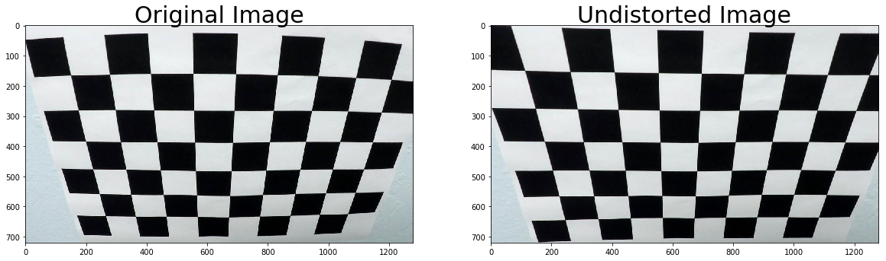
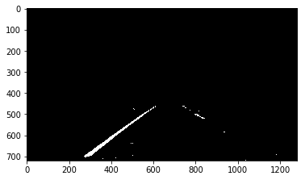
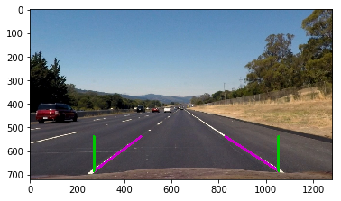
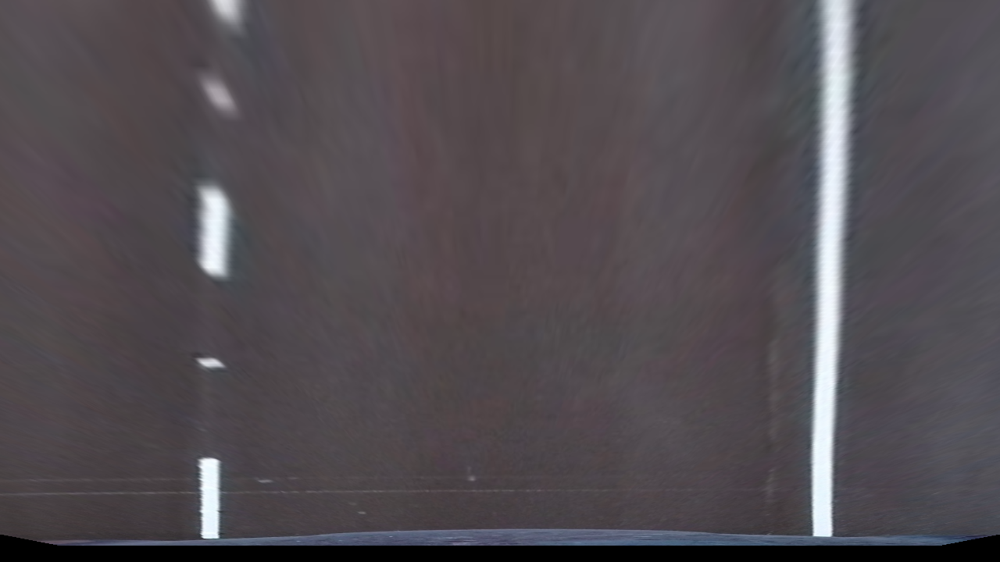
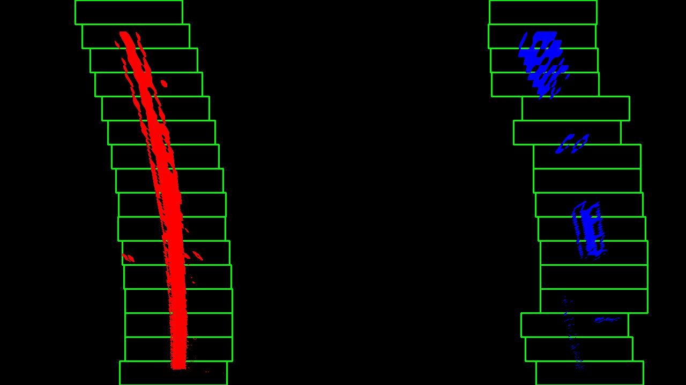
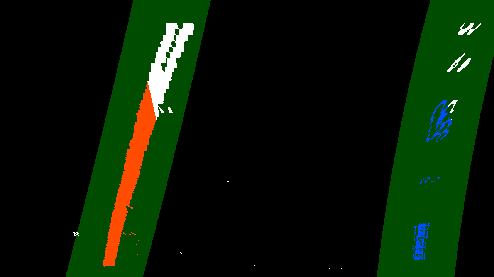
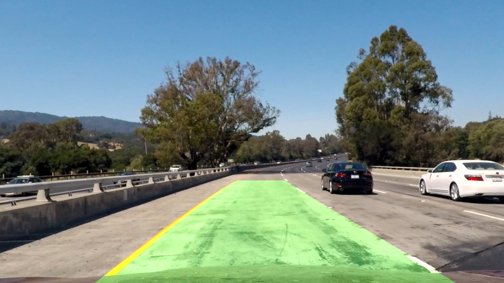

This report come as part of the Udacity Nanodegree on Self Driving Car Engineering.

### Introduction
In this project, the objective is to use the OpenCV library to perform track line recognition. We will start by testing our algorithm on images and then directly on videos.

### Description
In this project, the main part has already be seen during the course. The expectation here was to assemble the whole in an algorithm that will be able to process directly video input. In order to do so, we had to follow a certain number of steps which are the following:
  
* Compute the camera calibration matrix and distortion coefficients given a set of chessboard images.
* Apply a distortion correction to raw images.
* Use color transforms, gradients, etc., to create a thresholded binary image.
* Apply a perspective transform to rectify binary image ("birds-eye view").
* Detect lane pixels and fit to find the lane boundary.
* Determine the curvature of the lane and vehicle position with respect to center.
* Warp the detected lane boundaries back onto the original image.
* Output visual display of the lane boundaries and numerical estimation of lane curvature and vehicle position.
  
All the code for each step of this algorithm is contained in the `P2_Notebook`. We'll go through every step one by one.

1.Compute the camera calibration matrix and distortion coefficients given a set of chessboard images.

The code for this step has been given in the sample file and is therefore in the first cell of the nootebook. In this part, we take at least 20 images with different angles of the same white and black board and thanks to the function cv2.findChessboardCorners() of the openCV library we can find the straight line and the corners of the board.

2. Apply a distortion correction to raw images.

For this step, we use the function cv2.calibrateCamera() to find the distortion coefficients of our camera using the input, ret and corners that we defined in the last step.
Once we have our coefficients, we can distort our images. In order to avoid executing this code each time, we will save the coefficient in a file named `wide_dist_pickle.p`.
  
Here you can see the original picture of the chessboard and then the same one but undistored :
  

3. Use color transforms, gradients, etc., to create a thresholded binary image.

Now, in this part, we will try to create a binary image on which we can easily distinct the lane lines. In order to do so, we'll use 3 different filters:
  
  - The first one will detect the edges of the images and we will try to tune it in order to have the edges of the lane lines in sight most of the time.
  - The second will be the absolute derivative on the x-axis of the light in the image. We can do this after converting the RGB image into the HLS space (Hue, Saturation, Brightness).
  - Finally, the last one will be a threshold on the saturation of the image.

Translated with www.DeepL.com/Translator
  
By adding, this three filters together, we are able to obtain an image like this one:
  

4. Apply a perspective transform to rectify binary image ("birds-eye view").

First, in this part, we need an image where the road contains straight lines, then we get two points on each line and finally we can have a top-down perspective with the birdview() function by determining four points making a rectangle.
In order to get my points, I decided to use the algorithm of the last project which allows us to have point coordinates that correspond almost perfectly to the lines of the images without too much noise. So with this algorithm, I define the points on the lane lines at the extremity of the purple lines and the points I need at the extremity of the green lines:
 

Then, after using the function birdview(), we can see the road like this:
  

5. Detect lane pixels and fit to find the lane boundary.

In this part, we will detect the pixels of the lane lines, which is easier since we have applied our filters and we will try to calculate the polynomial curve of the scd order that best matches the lanes we have found. In order to do so, we will cut the image along the y axis in nwindows blocs and then we will search in this bloc for the lanes lines in order to have many differents points from the lines before interpolating our polynomial curve. Here is the result:
 

Then, if we process a video, the curves of the next images will be more or less the same. So, to save time, we'll just look in the area near the lines of the last image and we'll get something like that:
 

6. Determine the curvature of the lane and vehicle position with respect to center.

Here, we define the value in meters for a pixel on the x and y axes, then we calculate the average curvature of the two lines at the bottom of the image with the measure_curvature() function. We also measure the distance between the car and the center of the road. To do this, it is assumed that the camera is in the middle of the car even if it seems to have a 20 or 30 cm offset. We can now display these two figures on the video while it is being processed.

7. Warp the detected lane boundaries back onto the original image.
8. Output visual display of the lane boundaries and numerical estimation of lane curvature and vehicle position.

Step 7 and 8 are made in the same code cell, and the result once we've applied all the function from the precedent steps is that:

 
  
Finally, we use all these functions to process each image of the videos and we get something great for the project video and... something disastrous for both challenge videos :). However, there are still many variables that we can adjust or modify at each step. We will see this in the next section.  

### Reflexion

Now that the algorithm works effectively for easy road tracks, we need to improve it to make it more robust and to make it much efficient at detecting track lines.

I think there are at least 2 main points on which we could improve the efficience of the algorithm:

- At first, of course we could still try to optimize the variables of the image manipulation (pipeline function). In order to do so, as explain in the Udacity course, we could create a simple interface to modify each value in real time in order to gain time.
- Then we should try to improve the algorithm for lane finding. For example, we could form a simple neural network to recognize lane lines after the image has been processed. Once it is well trained, it should also require less processor to operate.

Finally, it would be useful to try to reduce the complexity of the algorithm in order to shorten the time required to process an image. Indeed, this algorithm is supposed to work live and therefore must be able to process an image in less than 40ms. Of course, it depends on the processor, but we will still have a lot of other calculations to do.
